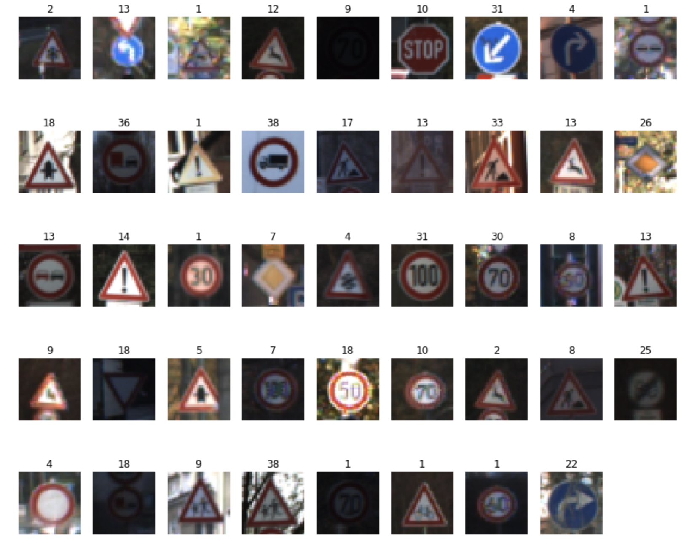
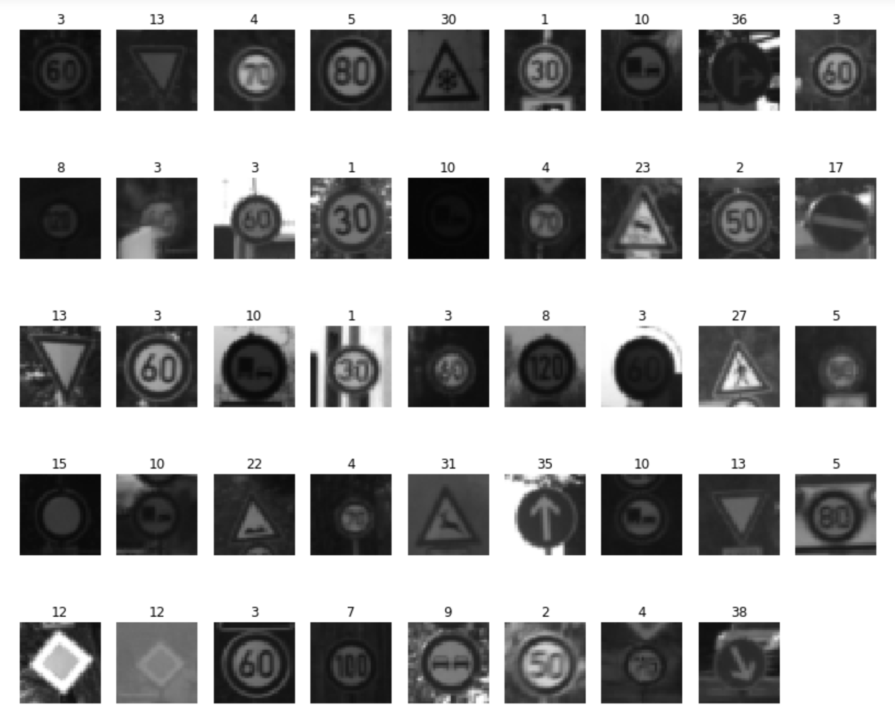
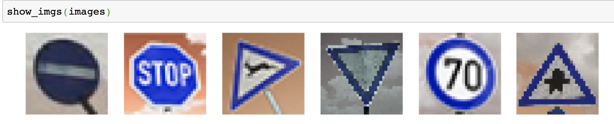
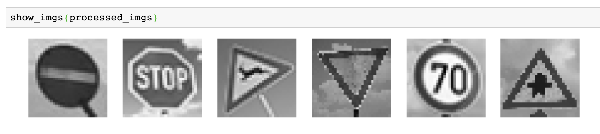
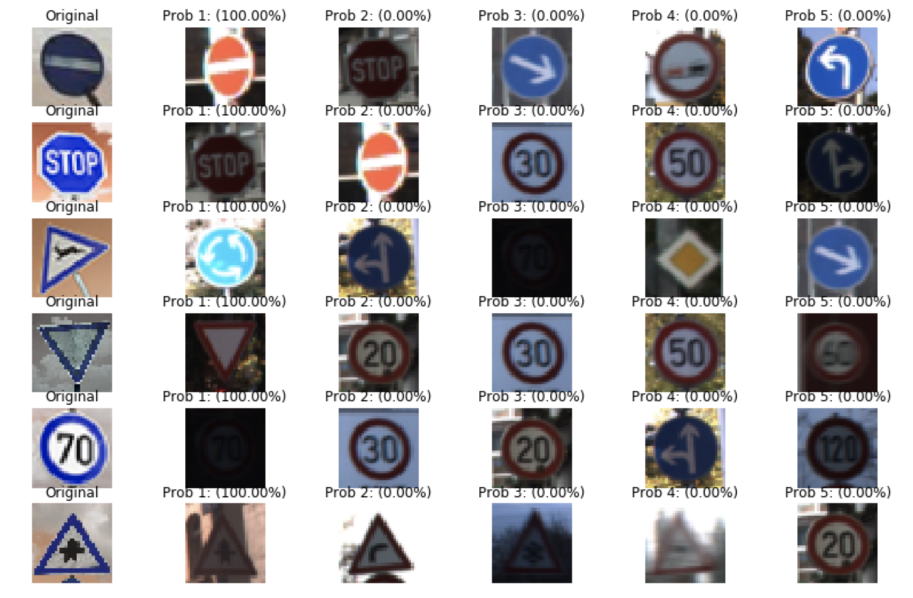

# **Traffic Sign Recognition**

---

**Build a Traffic Sign Recognition Project**

The goals / steps of this project are the following:
* Load the data set (see below for links to the project data set)
* Explore, summarize and visualize the data set
* Design, train and test a model architecture
* Use the model to make predictions on new images
* Analyze the softmax probabilities of the new images
* Summarize the results with a written report

## Rubric Points
### Here I will consider the [rubric points](https://review.udacity.com/#!/rubrics/481/view) individually and describe how I addressed each point in my implementation.  

---
### Data Set Summary & Exploration

#### 1. Provide a basic summary of the data set. In the code, the analysis should be done using python, numpy and/or pandas methods rather than hardcoding results manually.

I used the pandas library to calculate summary statistics of the traffic
signs data set:

* The size of training set is 34799
* The size of the validation set is 4410
* The size of test set is 12630
* The shape of a traffic sign image is 32*32*3
* The number of unique classes/labels in the data set is 43

#### 2. Include an exploratory visualization of the dataset.

I used numpy to randomly plot some images in the training set along with their labels, and the result is shown as follows:

 

### Design and Test a Model Architecture

#### 1. Describe how you preprocessed the image data. What techniques were chosen and why did you choose these techniques? Consider including images showing the output of each preprocessing technique. Pre-processing refers to techniques such as converting to grayscale, normalization, etc. (OPTIONAL: As described in the "Stand Out Suggestions" part of the rubric, if you generated additional data for training, describe why you decided to generate additional data, how you generated the data, and provide example images of the additional data. Then describe the characteristics of the augmented training set like number of images in the set, number of images for each class, etc.)

As a first step, I decided to convert the images to grayscale because the gray scale images are much more easier to find out the important information in the image,
and overcomes the color influences for training. In practice, I found out that if I use the gray scale images, the accuracy would be higher.

In the new image test part, the model trained with color image can get 3 over 6 images right, while the gray scale image can get 5 of them correct.

Here is an example of a traffic sign image after grayscaling.

 

Later I tried to normalize the images by subtracting the average and then divide by deviation, but the training process did not work well on it as the accuracy got decresed.

#### 2. Describe what your final model architecture looks like including model type, layers, layer sizes, connectivity, etc.) Consider including a diagram and/or table describing the final model.

My final model consisted of the following layers:

| Layer         		|     Description	        					| 
|:---------------------:|:---------------------------------------------:| 
| Input         		| 32x32x3 RGB image   							| 
| Convolution 5x5     	| 1x1 stride, same padding, outputs 28x28x12    |
| RELU					|												|
| Max pooling	      	| 2x2 stride,  outputs 12x12x25 				|
| Convolution 5x5	    | 1x1 stride, same padding, outputs 10x10x25    |
| RELU                  |                                               |
| Max pooling	      	| 2x2 stride,  outputs 5x5x25 				    |
| Fully connected		| 625 to 300        			    			|
| Fully connected		| 300 to 150									|
| Fully connected		| 150 to 43										|
| Softmax				| tf.nn.softmax(logits)							|
 

#### 3. Describe how you trained your model. The discussion can include the type of optimizer, the batch size, number of epochs and any hyperparameters such as learning rate.

To train the model, I used an 30 epoches, a batch size of 128, and the learning rate is set to 0.001. To optimize the learning accuracy, I used the `Adam Optimizer`.

#### 4. Describe the approach taken for finding a solution and getting the validation set accuracy to be at least 0.93. Include in the discussion the results on the training, validation and test sets and where in the code these were calculated. Your approach may have been an iterative process, in which case, outline the steps you took to get to the final solution and why you chose those steps. Perhaps your solution involved an already well known implementation or architecture. In this case, discuss why you think the architecture is suitable for the current problem.

My final model results were:
* training set accuracy of 99.2%
* validation set accuracy of 91.5%
* test set accuracy of 91.1%

If an iterative approach was chosen:
* What was the first architecture that was tried and why was it chosen?
The architecture chosen for this project was Lenet, as it is easy to implement and quite suitable for images of 32*32. And also it provides high accuracy for this project.

* What were some problems with the initial architecture?
This training set can get really high accuracy, but the same model can on the validation set can only get 90% accuracy, so there must be some problems with this architecture so that it cannot fit all the examples.

* Which parameters were tuned? How were they adjusted and why?
I increased the number of EPOCH, so that it can take more chances to optimize and get better result. When I keep the Epoch to 10, I found that the accuracy was not climbing at the last round, so there must some more spaces for the model to be trained.

### Test a Model on New Images

#### 1. Choose five German traffic signs found on the web and provide them in the report. For each image, discuss what quality or qualities might be difficult to classify.

Here are six German traffic signs that I found on the web:

 

The third image might be difficult to classify because the image is faded and the actual shape cannot be recognized.

To make the prediction better, I used the same preprocessing technique on the 6 images, and the result is shown as:

 

#### 2. Discuss the model's predictions on these new traffic signs and compare the results to predicting on the test set. At a minimum, discuss what the predictions were, the accuracy on these new predictions, and compare the accuracy to the accuracy on the test set (OPTIONAL: Discuss the results in more detail as described in the "Stand Out Suggestions" part of the rubric).

Here are the results of the prediction:

| Image			                        |     Prediction	        					|
|:---------------------:                |:---------------------------------------------:|
| No-entry       		                | No-Entry  									|
| Stop sign    			                | Stop sign										|
| Wild animals crossing	                | Speed limit (70km/h)							|
| Yield           		                | Yield     					 				|
| Speed limit (70km/h)	                | Speed limit (70km/h)   						|
| Right-of-way at the next intersection	| Right-of-way at the next intersection 		|

The model was able to correctly guess 5 of the 6 traffic signs, which gives an accuracy of 83.3%. This is close to the result we did on the test set previously.

#### 3. Describe how certain the model is when predicting on each of the five new images by looking at the softmax probabilities for each prediction. Provide the top 5 softmax probabilities for each image along with the sign type of each probability. (OPTIONAL: as described in the "Stand Out Suggestions" part of the rubric, visualizations can also be provided such as bar charts)

The code for making predictions on my final model is located in the last second cell of the Ipython notebook.

For the third image, which was discussed previously that was not easy to recognize. the model is relatively sure that this is a Roundabout mandatory sign of 70km/h (probability of 1.0).
For the other 5 images, the model got 100% sure that they are right.

The following is the result of this part:

 

